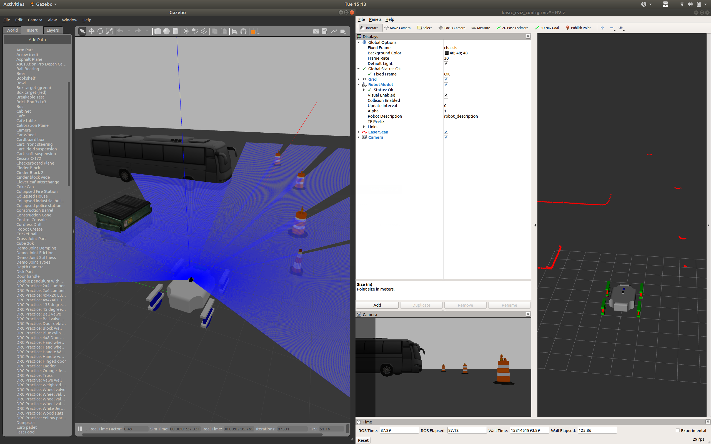
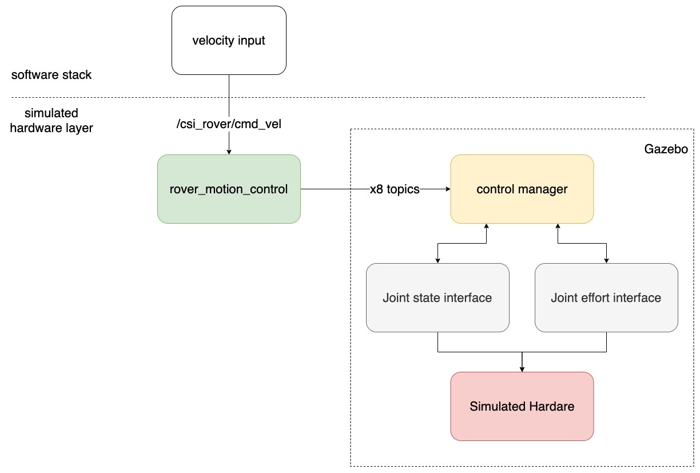
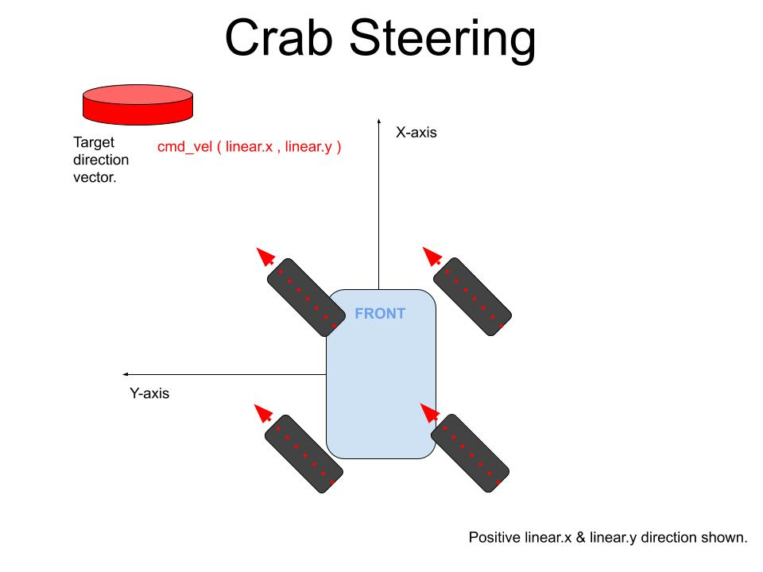
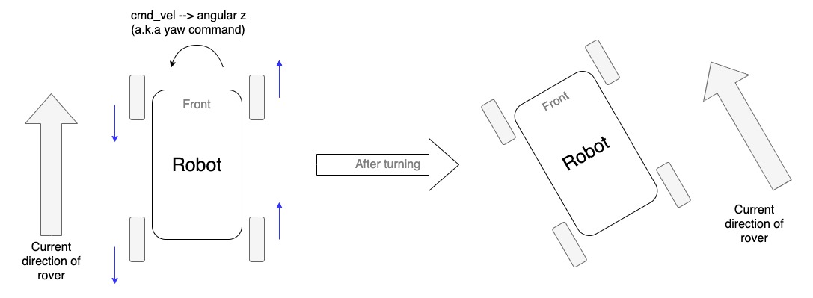
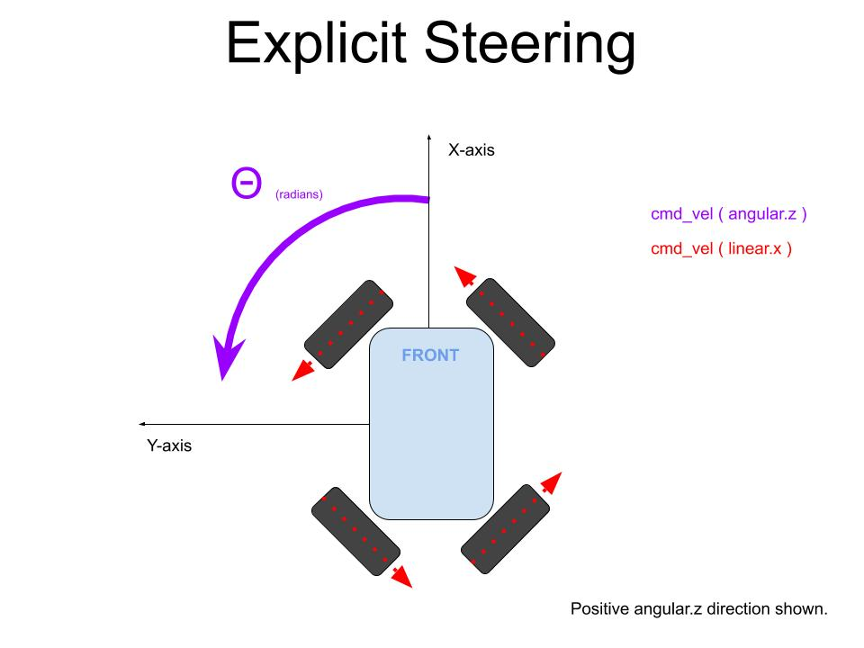

# Description of Robot Model

## Current Status:

#### Version 1

Version 1 aims to create a functioning rover. The MVP is a rover that has all required joints and the motion can be controlled using `cmd_vel`.

- [x] Create a rover model with all links and joints
- [x] Add LIDAR sensor to the rover model
- [x] Add camera sensor to the rover model
- [x] Add IMU sensor to the rover model
- [x] Add basic control for the rover model. 
- [x] Add rviz. 
- [x] Add pre-built `skid_steering` plugin to the robot. 

#### Version 2

For version 2, we will add our own controller to the robot. The robot should be controlled by the `cmd_vel` topic, and can accomplish both crab walk and skid steering. The robot should also look more realistic. 

- [x] Test driving and steering extensively. Verify that the rover can move properly. 
- [x] Add crab walk driving to robot. 
- [x] Add our own skid steering to robot.  
- [x] Conduct more extensive testing.  
- [x] Add motor encoder sensor to the model. 
- [x] Improve model appearance. 

This document provides an overview of the robot model for the SRC challenge. If you want to cut to the chase, please jump to the `How to Launch` section.  

## Packages

`csi_rover_controls`: This package contains all of the control components for the robot. Currently, this package contains an important yaml file for config purposes. 

`csi_rover_description`: This package defines the physical robot. The urdf files located in the `urdf` directory are very important. The `csi_rover.gazebo` file provides the sensor descriptions and some material descriptions for the robot. `csi_rover.xacro` defines the links and joints of the rover. `macros.xacro` defines all of the macros for the rover. The reason behind having a stand-alone file for macros is for debugging and convenience. 

`csi_rover_gazebo`: This package contains the main launch file for the rover. It doesn't provide any robot description. However, it can eventually provide a description of the gazebo world. 

## The Software Structure

Everything inside the dotted box labeled Gazebo is built-in with Gazebo. We have control over the eight different joints on this robot. We can control them individually. 

The purpose of the `rover_motion_control` node is to create an interface between the software stack and the hardware simulation. The robot can be controlled with one topic, `csi_rover/cmd_vel`. The `cmd_vel` has six parameters, linear velocity x, y, z and angular velocity x, y, z. 

## How to Launch

1. Navigate to your catkin workspace. 
2. Run `catkin_make`
3. `source devel/setup.bash`
4. `roslaunch csi_rover_gazebo csi_rover_rviz.launch` This is launch with rviz. 

## Sensors and topics

The robot name is: `csi_rover`

| Device      | Topic       | Message Type     |
| :---        |    :----    |          :---    |
| 2D Lidar    | `/csi_rover/laser/scan`        | sensor_msgs/LaserScan | 
| Camera      | `/csi_rover/camera/front/image_raw`| sensor_msgs/Image      |
| 6 DoF IMU   | `/csi_rover/imu`        |   sensor_msgs/Imu    |
| Front right wheel encoder | `/csi_rover/fr_wheel/encoder_value` | std_msgs/Float64 |
| Front left wheel encoder  | `/csi_rover/fl_wheel/encoder_value` | std_msgs/Float64 |
| Rear right wheel encoder  | `/csi_rover/rr_wheel/encoder_value` | std_msgs/Float64 |
| Rear left wheel encoder   | `/csi_rover/rl_wheel/encoder_value` | std_msgs/Float64 |

## Odometry (ground truth)
Currently, the rover's odometry is not being calculated. The tf that's published is simply the "ground truth" odometry. The odometry plugin (can be found in `csi_rover.xacro`) reads the currently position and ve
locity of the rover, and publishes that as the odom frame. Here's the tf tree. 

## Driving

To drive the robot, you can send command to the topic `/csi_rover/cmd_vel`. You need to send both a linear and angular velocity. You can also use `rqt` to launch a visualizer and control the rover. 

### Rover Movement

There are three main driving schemes for controlling the robot, crab walk, explicit steering and skid steering. Crab walk listens to the linear velocity of the rover, and turns all the steering joints to the direction of the linear velocity command. Then the rover will move at the given speed (magnitude of the linear velocity vector). Crab walk doesn't yet allow the body of the rover to turn. 

Skid steering system doesn't turn the steering joints of the rover. It turns the four wheels at different speeds to achieve turning. [see second diagram]. Skid steering only looks at the linear x and angular z (a.k.a. yaw) velocity in the `cmd_vel`. It calculates the wheel velocity using these inputs and the geometry of the rover. 

Explicit Steering should be used for turning as of February 26 2020. [see third diagram]
To turn THETA (radians) send an angular.z command, and the speed you want the wheels to turn at with linear.x on the cmd_vel topic. You can use the rqt gui that launches to try it out and click any topic with a rate of 20. Any other command should be linear.x with range of (-1.5,1.5) value. Do not send any y values as those are to be integrated with the crab steering at a later date.
To effectivley use the explicit Steering to turn, 3 things are needed. 

* 1--- Send the THETA (radians) you with to turn ( neg or pos ) on the angular.z command through the cmd_vel topic.
* 2--- If you need to turn again by the same degrees as before please publish self.angular_z at 0.0000100010001 radians. ( this will reset the buffer that prevents the rover from turning indefinitely ). *If the new angle is different then you can just go ahead and send the new angle without resetting the buffer.*
* 3--- If you are ready to drive forward or backwards : Send the linear.x command  whilst making sure the angular.z is 0.

This diagram illustrates the crab walk driving system. 

This diagram illustrates the skid steering system. 

This diagram illustrates the explicit steering system. 

